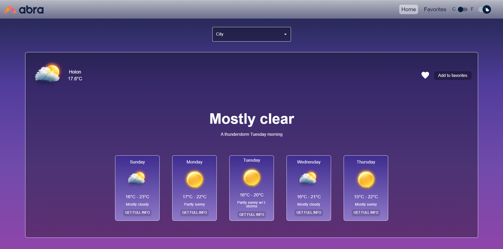
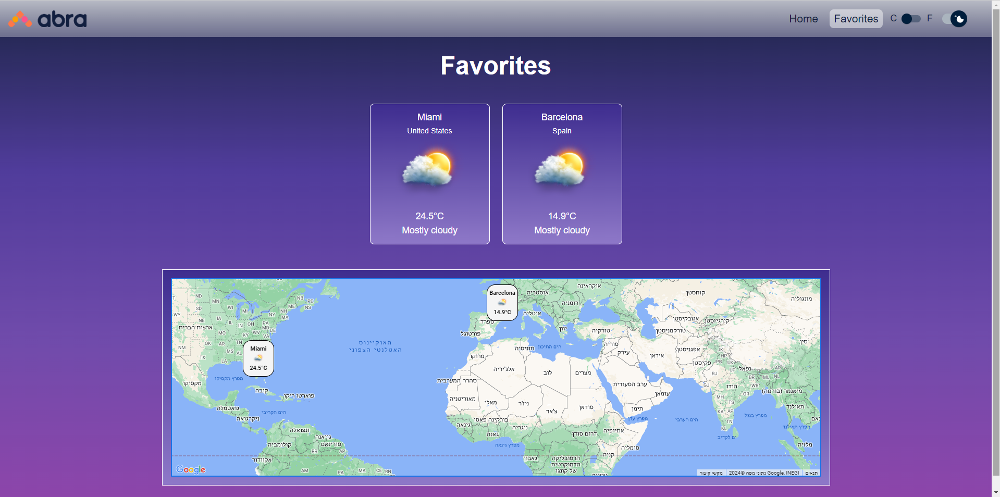
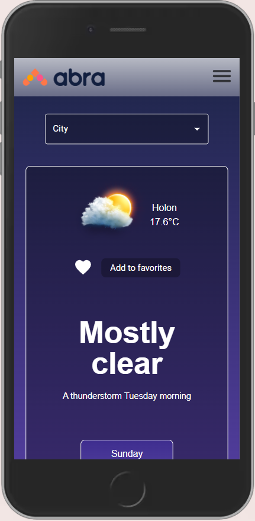
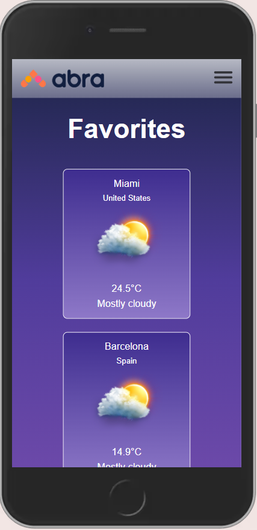

# Abra home assignment. 
[Live demo here](https://abragalbennatan.onrender.com "Abra weather app")



## This project is built using React, Redux, SASS, MaterialUI, Axios, Local Storage, Google maps API, AccuWeather API and API Ninjas.

## Application Features
- Search for every city in the world with autocomplete.
- 5 days weather forecast.
- Updated weather conditions.
- Toggle celsius/fahrenheit.
- Dark/Light mode.
- Save cities to favorites.
- Favorite cities can be seen in a google map.
- Event bus for showing error/success massages.

## Getting started

Head to the repository on top and clone the project or download the files.

```
git clone https://github.com/galbarcessat/Gal-BenNatan-2-4-2024
```
Enter the frontend folder.

```
npm i 
npm run dev
```

You should get a console ouput that the server is up and running at localhost:5173.

That's it! The App should be opened automatically, enjoy!

## Showcase




### Some mobile!
Just a taste of the mobile experience.

<div style="display: flex; flex-direction: row; justify-content: center;">
    
    
</div>


